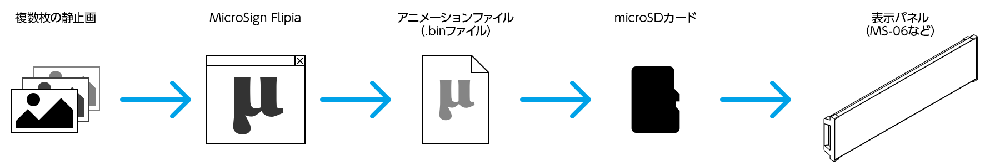
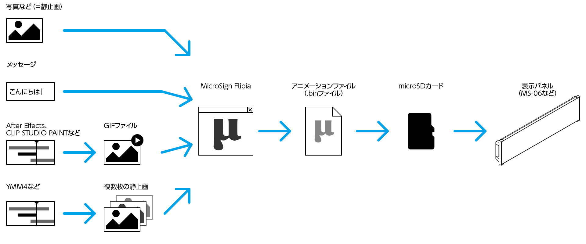

## 目次

- [概要](#概要)
- [アニメーションの長さについて](#アニメーションの長さについて)
- [基本操作](./microsign_manual_basic.md)
- [写真のアニメーションを作成](./microsign_manual_picture.md)
- [メッセージのアニメーションを作成](./microsign_manual_text.md)
- [CLIP STUDIO PAINTを使ったアニメーションの作成](./microsign_manual_clipstudio.md)
- [ゆっくりMovie Maker 4 を使ったアニメーションの作成](./microsign_manual_ymm4.md)

## 概要

MicroSignシリーズの表示パネル(MS-06など)でアニメーションを表示するのに「専用のアニメーションファイル」を必要とします。
この専用のアニメーションファイルを作成するのが「MicroSign Flipia」(マイクロサイン フリピア)となります。

MicroSign Flipiaでは静止画を連続して表示する「パラパラ漫画方式のアニメーション」を作成します

表示パネルのサイズに合わせた静止画を複数枚用意し、
それぞれの静止画に対して何秒間表示するかを設定することでアニメーションを作成します

作成したアニメーションは「変換」することで「専用のアニメーションファイル」(.binファイル)を作成します。
この作成した専用のアニメーションファイルをmicro SDカードに入れ、表示パネル(MS-06など)に挿入することでアニメーションが表示されます。

これら全体の流れは以下となります

また複数枚の静止画を用意しなくても
簡単にアニメーションを作成する機能として

- 写真をスクールして表示する → 「1枚画像からアニメーションを作成する」
- 文字列をスクロール表示する → 「文字を入力してアニメーションを作成する」

が存在します。
複数枚の静止画の作成が難しい場合にご活用ください.

本格的なアニメーションを表示したい場合は

- Adobi After Effect,Clip Studioなどを使ってGIFアニメーションファイルを作成する
- ゆっくりMovieMaker4(YMM4)などを使っての連番の静止画を作成する

など外部ツールを使用してください

これらの以下のような流れになります

この中で一番のおすすめなのは「GIFファイル」を使用する方法です

これは表示パネルに「最大256色までしか使用できない」制限があるためです。
写真などをそのまま使うと最大256色を超えてしまうことが多いのですが、
この場合MicroSign Flipiaが減色処理を行い256色までとなるように調整します。
ただ、このMicroSign Flipiaの減色処理はAdobi After Effectなどに比べると簡素なものとなっているため
Adobi After EffectなどでGIFファイルを作成した方がきれいな映像となります。

よってできるだけGIFファイルでの運用をお勧めします

このほかにもGIFファイルであれば複数の静止画の管理やフレームの表示期間なども
合わせて保存されているので、非常に扱いやすいのでお勧めです。

※ケレスソフト内ではGIFファイルでアニメーションを管理しています

## アニメーションの長さについて

MicroSign Flipiaで作成できるアニメーションの長さ(=表示時間)に制限はありませんが
表示パネル(MS-06など)側には保持できるフレームの数(=アニメーション画像の数)に制限があり、
「**30 fps で10秒ほど**」が制限になります。

1フレームの表示期間が長い場合、例えば15 fpsであれば
30 fpsの2倍となる20秒ほどが目安になります

アニメーションの長さが表示パネルの制限を超えた場合は、
読込失敗となりアニメーションは表示されません。

弊社の経験上、表示パネル前に10秒も立ち止まって見ていただける方はあまりいらっしゃらないので
5秒～10秒程度の短くインパクトのある映像を流すことをお勧めします
