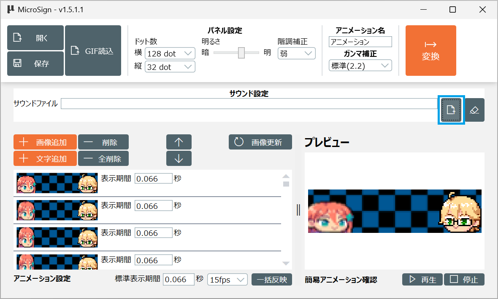
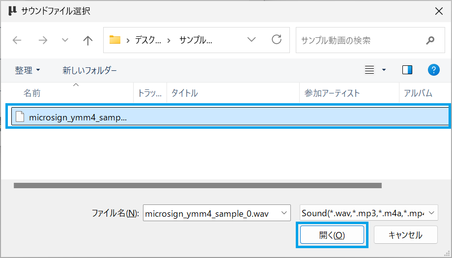
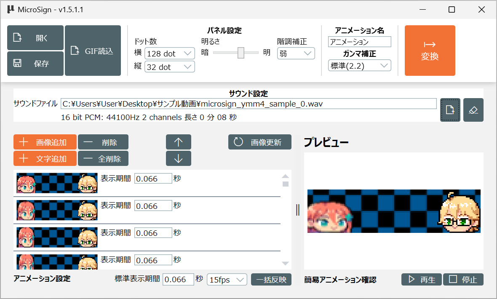

[操作マニュアル - TOP](./microsign_manual.md) 

## ゆっくりMovie Maker 4 を使ったアニメーションの作成

ゆっくりMovie Maker 4 (YMM4) を使って表示パネル向けのアニメーションを作成する方法です

[YMM4](https://manjubox.net/ymm4/)

YMM4 でアニメーションを作成する手順は説明しません。
あくまで YMM4 で表示パネル向けのアニメーションを作成するときの
設定などについて説明します

MicroSign Flipiaの操作方法は[基本操作](./microsign_manual_basic.md)を参照してください

### 動画の設定

YMM4で一番最初に行う「動画の設定」です
メニューから「ファイル」→「動画の設定」を開きます

以下のように設定してください

|項目          |設定値  |
|--------------|--------|
|画面サイズ    |「カスタム」で表示パネルのドット数(128x32など)に設定してください|
|フレームレート|10fps、15fps、20fp、30fpsあたりを選択してください 弊社では動きの激しいものは30fps、手書きアニメーションは15fpsで作成しています|
|音声サンプリングレート|44,100Hzを選択してください|

これで動画の作成を行ってください

### キャラクターの配置

任意のキャラクター素材をプロジェクトに追加し、立ち絵として使用します  
**キャラクター素材の導入方法は、各素材の配布元にてご確認ください**

MicroSignリポジトリにて配布しているYMM4向け素材を使用する場合は、以下のページをご覧ください

- [**YMM4向け素材 配布ページ**](../Materials/ymm4.md)  
- [**キャラクター素材の導入方法**](../Manuals/ymm4_material_usage.md) 

メニューから「ファイル」→「アイテムを追加」→「立ち絵アイテム」を選択します

キャラクターの立ち絵が動画に追加されます

立ち絵をドラッグし、配置を調整します

動画に音声を追加する場合、「ボイスアイテム」または「音声アイテム」を追加します

必要に応じて、エフェクトや別のキャラクターを追加し、動画を作成します

### 動画出力

YMM4で動画の出力を行う画面を開きます

動画出力画面が開くので以下のように設定して出力してください

|項目           |設定値           |
|---------------|-----------------|
|動画出力       |連番PNG + WAV出力|
|連番PNG出力    |ON               |
|WAV出力        |音声を使用している場合はON|

その他は出力したい動画に合わせてください

フォルダの選択画面が開くので、連番pngを出力するフォルダを選択します

以下のように動画が出力されます

### MicroSign Flipiaへの取り込み

MicroSign Flipiaを起動し、ドット数を表示パネルのドット数にします

標準表示期間をYMM4で設定したFPSの表示期間に設定します
今回は15 fps で作成したので、コンボボックスから「15fps」を選択します

YMM4で出力した連番PNGをMicroSignのタイムラインにドラッグ＆ドロップして
連番PNGをフレームとして登録します

以上でYMM4で作成したアニメーションをフレームとして登録できます

サウンドファイル選択ボタンをクリックし、音声を取り込みます

連番PNGと同じフォルダに作成された音声ファイルを選択します

以上でYMM4で作成した音声をサウンドファイルとして登録できます

※音声を使用しない場合、サウンドファイルの選択は不要です
