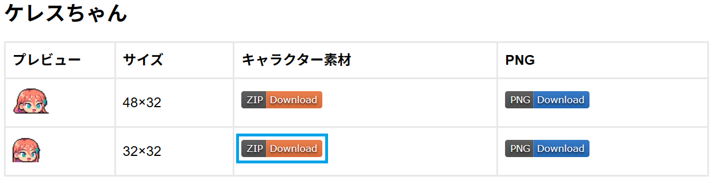
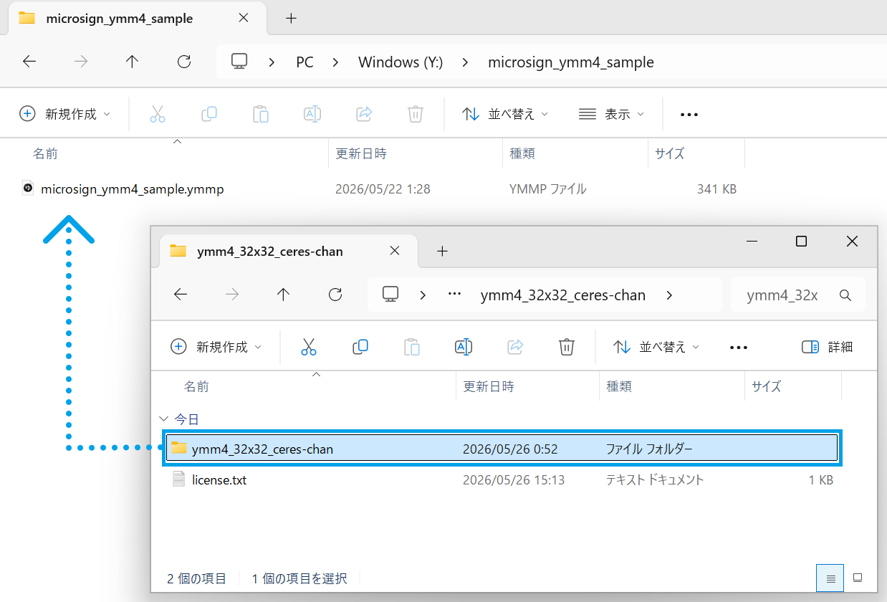
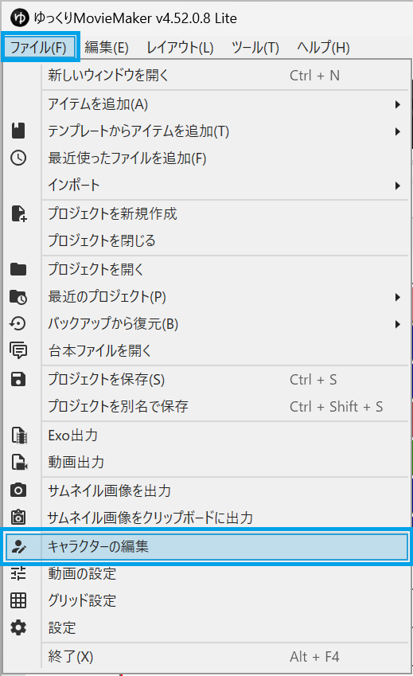
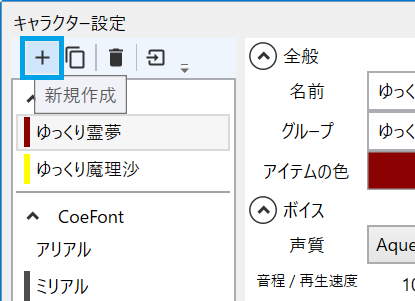
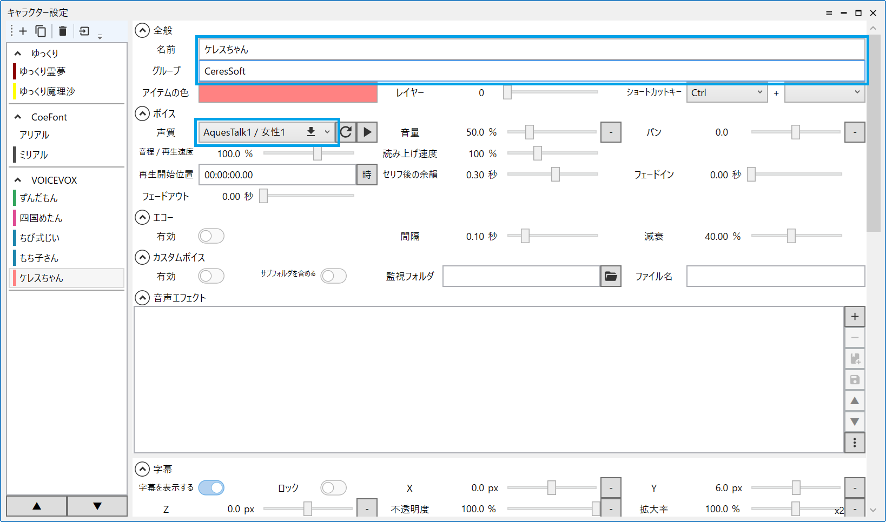
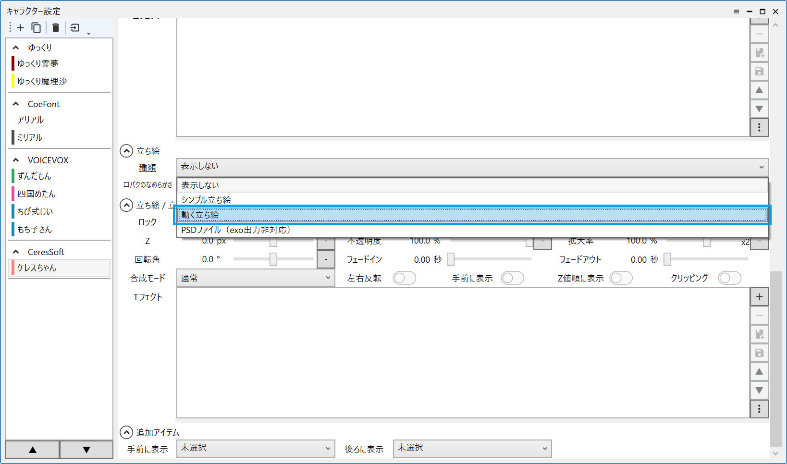
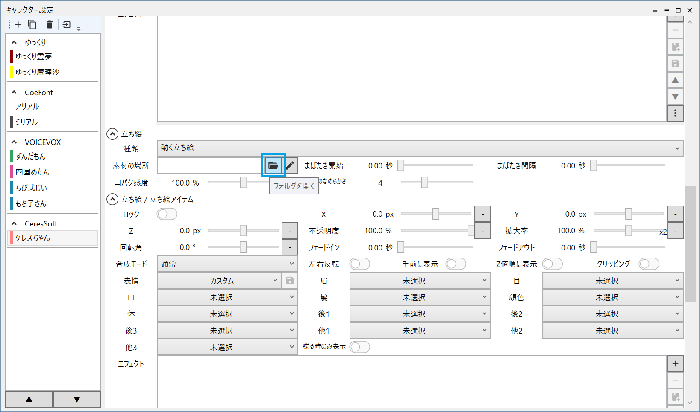
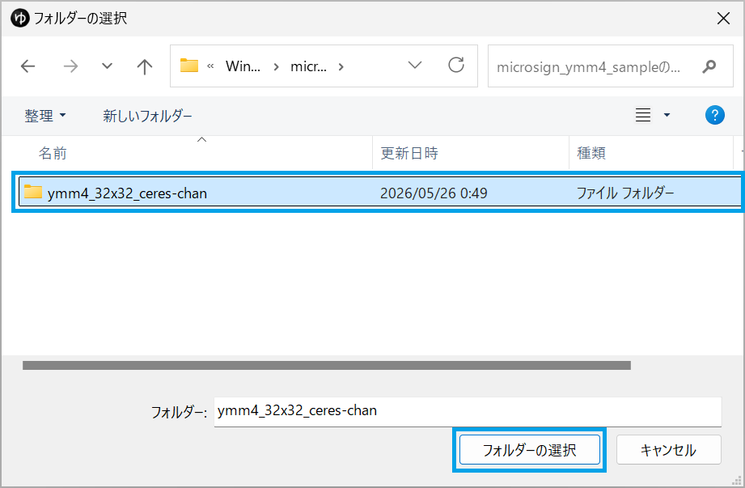
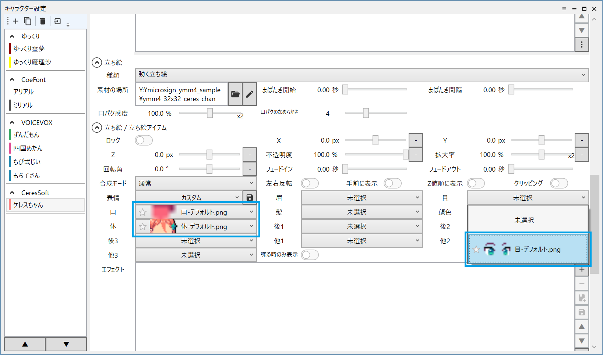

# YMM4向け素材 導入方法

以下の説明では「ケレスちゃん 32×32」の素材を例とします。

### 素材の配置

YMM4向け素材のダウンロードページから、キャラクター素材をダウンロードします。
「ZIP Download」というボタンをクリックすることでダウンロードが始まります。

ダウンロードしたZIPファイルを展開すると、`ymm4_32x32_ceres-chan`というフォルダーがありますので、このフォルダーを任意の場所に移動します。
プロジェクトファイルと同じフォルダーに移動するのがおすすめです。

### キャラクターの追加

YMM4のプロジェクトを開き、「キャラクターの編集」を選択します。

「キャラクター設定」画面が開くので、「新規作成」ボタンをクリックします。

キャラクターが追加されるので、名前とグループを設定します。
ボイスを使用する場合は任意のボイスを選択します。

「立ち絵」の種類を「動く立ち絵」に変更します。

「素材の場所」のフォルダボタンをクリックします。

`ymm4_32x32_ceres-chan` フォルダーを選択します。

`ymm4_32x32_ceres-chan` フォルダーの中身はYMM4の動く立ち絵のファイル構成に沿っていますので、これで立ち絵アイテムとして使用可能になります。
目パチ・口パクに対応した素材であれば、パーツを選択するだけで自動的に目パチ・口パクが効くようになります。

