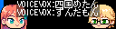
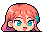
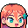
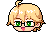

# YMM4向け素材

YMM4でキャラクターとしてお使いいただける素材です。

キャラクター素材は、YMM4で「動く立ち絵」として使用できるファイル構成になっています。
ZIPファイルを解凍後、動く立ち絵の素材の場所として選択してください。

## 利用規約

ZIPファイルに同梱されている`license.txt`をお読みください。

---

## YMM4用プロジェクト

|プレビュー|内容|プロジェクトファイル|備考|
|----------|----|--------------------|----|
||トーク動画サンプル||ボイス機能のサンプルとしてVOICEVOXを使用しています VOICEVOX:四国めたん VOICEVOX:ずんだもん|

※素材ファイルの参照がうまくいかない場合、 Cドライブ直下へのプロジェクトフォルダー配置をお試しください。

## キャラクター素材

[**キャラクター素材の導入方法はこちら**](../Manuals/ymm4_material_usage.md)

### ケレスちゃん

|プレビュー|サイズ|キャラクター素材|PNG|
|----------|------|----------------|---|
||48×32|||
||32×32|||

### ソフトくん

|プレビュー|サイズ|キャラクター素材|PNG|
|----------|------|----------------|---|
||48×32|||
||32×32|||
